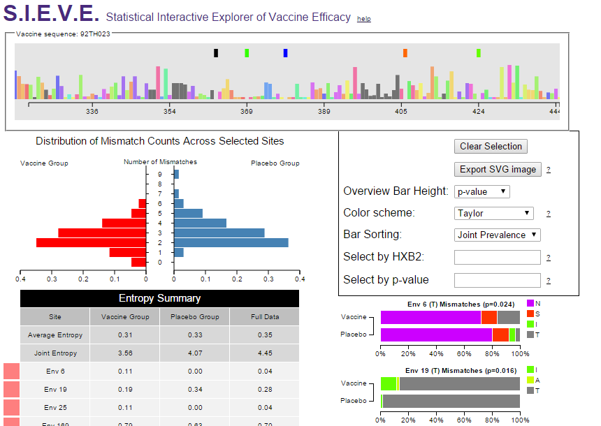
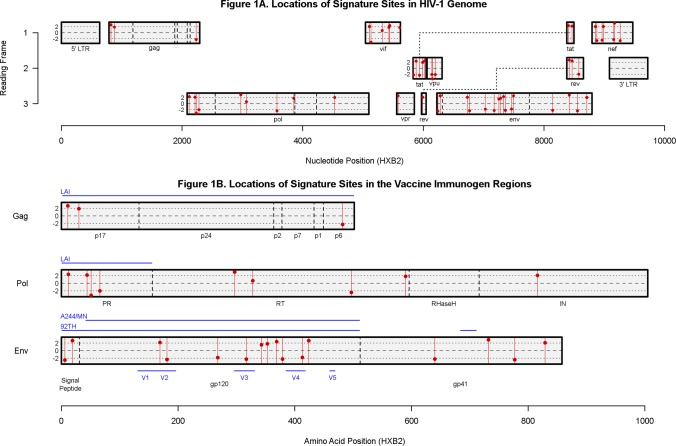

S.I.E.V.E: Statistical Interactive Explorer of Vaccine Efficacy
===============
Nick Kullman, Graham Clenaghan, Wayne Yang

SIEVE is an intereactive visualization for exploring data from vaccine studies. Specifically, we aim to aid the process of sieve analysis, which compares the genetic sequences of viruses found in infected patients between vaccine and placebo groups. The visualization allows researchers in the field to study the affect of a vaccine at the level of the amino acids in the breakthrough viruses, and find statistically significant differences in the groups. This work was done in collaboration with Andrew Gartland and Allan DeCamp at Fred Hutch.

[Poster](https://github.com/CSE512-15S/fp-nkullman-gclenagh-wfyang/blob/master/final/poster-nkullman-gclenagh-wfyang.pdf),
[Paper](https://github.com/CSE512-15S/fp-nkullman-gclenagh-wfyang/blob/master/final/paper-nkullman-gclenagh-wfyang.pdf),
[Webpage](http://cse512-15s.github.io/fp-nkullman-gclenagh-wfyang/)

## Running Instructions

Access our visualization at http://cse512-15s.github.io/fp-nkullman-gclenagh-wfyang/main.html or download this repository and run `python -m SimpleHTTPServer 9000` and access this from http://localhost:9000/main.html.

## Research/Development Process

The researchers we worked with wanted an interactive and automated version of graphics which had already appeared in a paper:

We used these as inspiration and split the project into three parts which were our initial roles: Nick worked on an overview chart which showed the entire reference genome and would allow selection of sites, Graham worked on a stacked bar chart showing the mismatch counts for each site, and Wayne implemented the statistics methods and wrote graphics and a table to put statistics for the selected group as a whole. The overview/selection portion proved to be the most difficult to design and implement, and we spent the most time fine-tuning this to have the navigation and selection be natural: everyone on the team had some role in the final product.

After getting the first working prototype running, we met again with the researchers and continued to polish the tool and tailor it to how they intended to use it, for instance adding a "Select by HXB2" option so that if one had a specific site in mind, they could select it without having to use the interface to find it.

## Credits

* Nick Kullman: Overview chart navigation and design, loading files
* Graham Clenaghan: Site stacked bar charts, selection, options, box plots
* Wayne Yang: Statistics/R calculations, pyramid chart, entropy and mismatch table 
